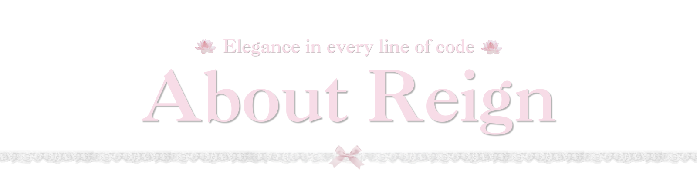
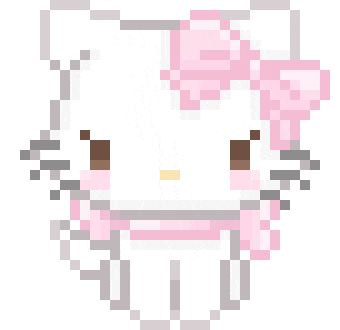
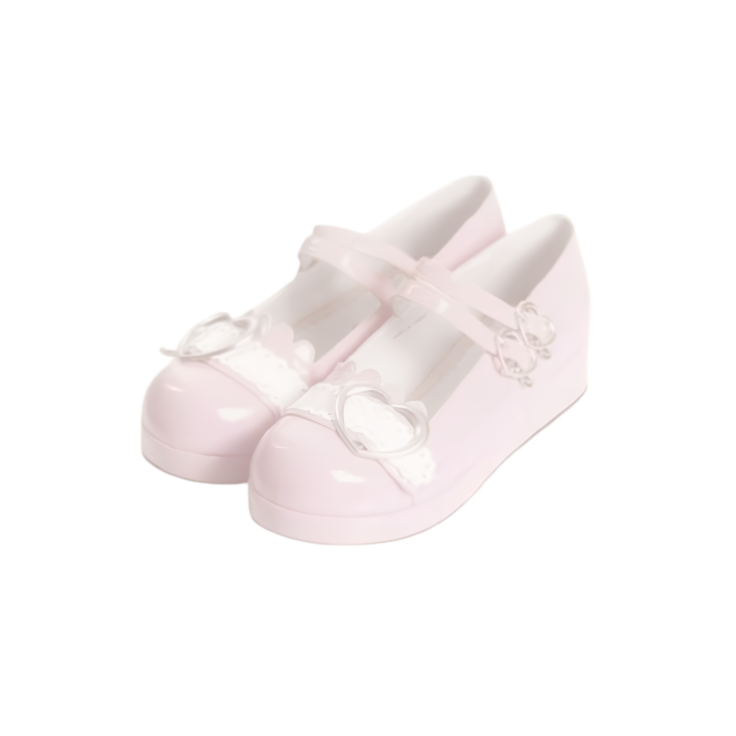
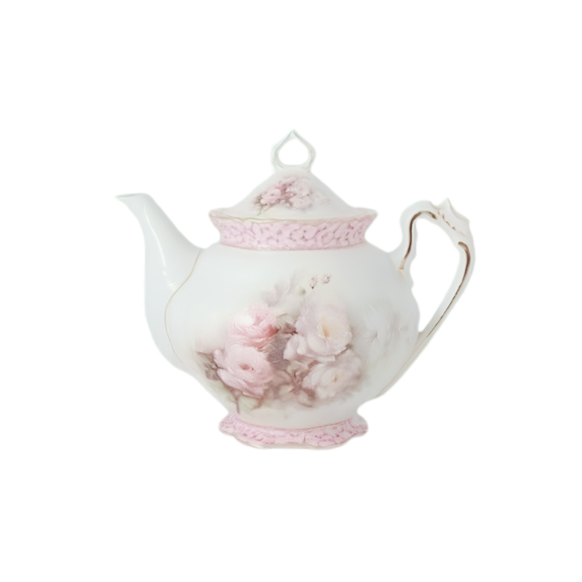

<picture>
  <source media="(prefers-color-scheme: dark)" srcset="./headerdark.svg">
  <source media="(prefers-color-scheme: light)" srcset="./headerlight.svg">
  
</picture>

  

<h2>Hello, I'm Raven Reign! :cherry_blossom:</h2>

IT sophomore • Aspiring Data Analyst • Community Leader

I enjoy managing projects, leading tech communities, and using data and technology to create meaningful impact through inclusivity and women empowerment.

Currently, I serve as the Operations Head of AWSUG Enovators PH and One of the Leads in Build Nights: KiroVerse Workshop Series. I've also had the opportunity to serve as a Program Manager at DEVCON and complete a Quality Assurance Internship at Otis Philippines.

Outside of community work, I'm a Student Assistant at my university's computer laboratory, where I help maintain laboratory computers and support daily technical operations.
 
  

 

&emsp;&nbsp;
  &emsp;&nbsp;&emsp;&nbsp;&emsp;&nbsp;&nbsp;&emsp;&nbsp;&emsp;&nbsp;&nbsp;
  &nbsp;&emsp;&nbsp;&emsp;&nbsp;&emsp;&nbsp;&nbsp;&emsp;&nbsp;&emsp;&nbsp;&emsp;
  &emsp;&nbsp;&emsp;&nbsp;&emsp;&emsp;&nbsp;&emsp;&nbsp;&emsp;
   

&nbsp;&emsp;
  <b>LinkedIn</b>&nbsp;&emsp;&nbsp;&emsp;&nbsp;&nbsp;&emsp;&nbsp;&emsp;&nbsp;&nbsp;&nbsp;&nbsp;&nbsp;
  <b>Instagram</b>&emsp;&emsp;&nbsp;&emsp;&nbsp;&nbsp;&emsp;&emsp;&emsp;&emsp;
  <b>Facebook</b>&emsp;&emsp;&nbsp;&emsp;&nbsp;&nbsp;&emsp;&nbsp;&emsp;&nbsp;&emsp;&nbsp;&nbsp;
  <b>Email</b>&nbsp;&nbsp;

 

  

  Tech Stack 

  

